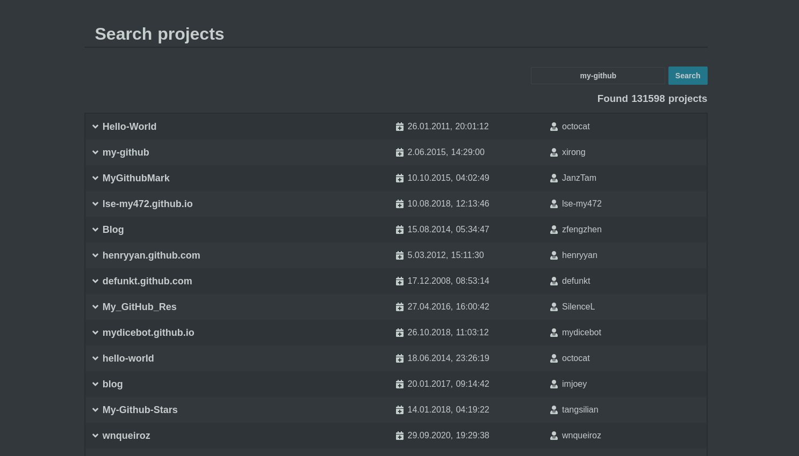

# my-github

> Nuxt.js project

## Build Setup
### Project setup

1. Clone repository
2. Install the dependencies using:
``` 
npm install # Or yarn install
```
### Serve with hot reload at localhost:3000
Run project using:
```
npm run dev
```
Go to page http://localhost:3000/ (default)

### Run project test
1) Run project `npm run dev` (if isn't running)
2) Run tests 

    a) in [cypress task runner (with GUI)](https://docs.cypress.io/guides/core-concepts/test-runner.html#Overview)

    ```
    npm run test:open
    ```
    b) or only in terminal:

    ```
    npm run test
    ```
### Build for production and launch server
```
npm run build
npm start
```
### generate static project
```
npm run generate
```
For detailed explanation on how things work, checkout the [Nuxt.js docs](https://github.com/nuxt/nuxt.js).


## Project description / requirements

see (only in Polish): [ZadanieTestowe-Frontend.pdf](static/ZadanieTestowe-Frontend.pdf)


